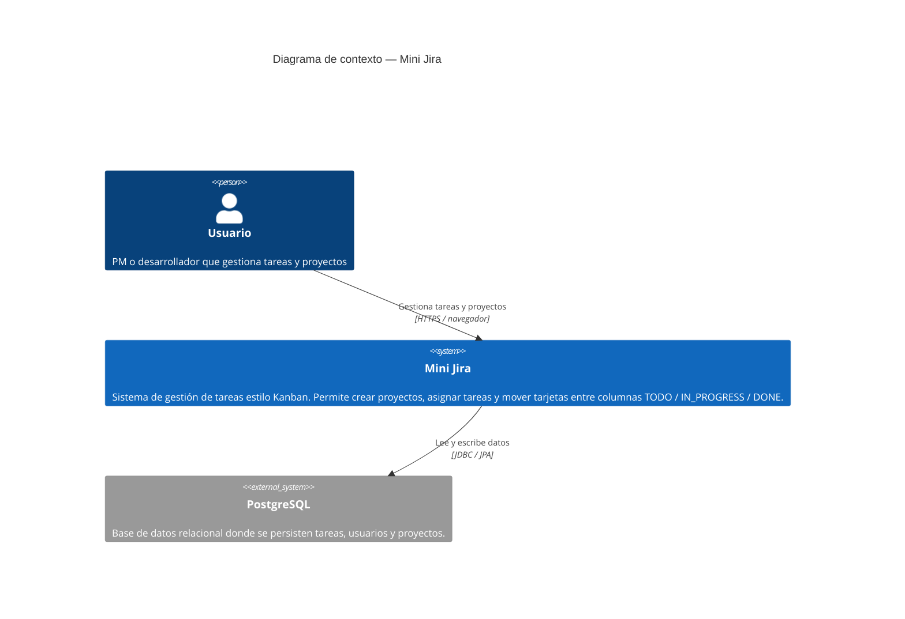

# C4 Nivel 1 — Context

Mini Jira visto desde afuera: quién lo usa y con qué sistemas conversa.

## Diagrama

## Descripción

Mini Jira es un sistema de gestión de proyectos liviano, inspirado en Jira. Permite a equipos de desarrollo organizar su trabajo en tableros Kanban con tres estados de tarea: **TODO**, **IN_PROGRESS** y **DONE**.

### Actores

| Actor | Descripción |
|-------|-------------|
| Usuario | PM, tech lead o desarrollador. Accede desde el navegador. No existe autenticación en la versión actual. |

### Sistemas externos

| Sistema | Rol |
|---------|-----|
| PostgreSQL | Única dependencia de infraestructura. Almacena las tres entidades del dominio: Task, User, Project. |

### Lo que Mini Jira NO hace (fuera de scope v1)

- Autenticación / autorización de usuarios.
- Notificaciones (email, Slack, etc.).
- Integraciones con repositorios Git.
- Reportes o dashboards analíticos.

---

Siguiente nivel: [02-container.md](02-container.md)
