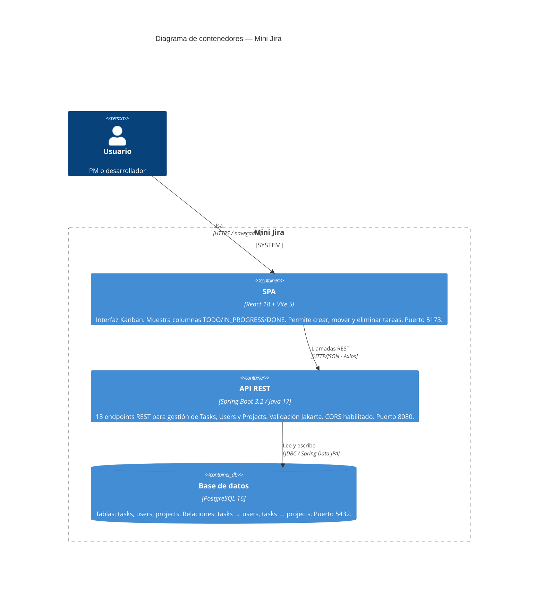

# C4 Nivel 2 — Container

Zoom dentro del sistema Mini Jira: los tres contenedores desplegables de forma independiente.

## Diagrama

## Descripción de contenedores

### SPA — React 18 + Vite 5

Interfaz de usuario construida como Single Page Application. Comunica con la API a través de Axios. La URL base de la API se configura con la variable de entorno `VITE_API_URL` (default: `http://localhost:8080`).

**Componentes principales:**
- `Header` — barra superior con el título de la aplicación.
- `App` — componente raíz; gestiona el estado global de tareas, usuarios y proyectos.
- `KanbanBoard` — renderiza las tres columnas del tablero.
- `KanbanColumn` — columna individual (TODO / IN_PROGRESS / DONE).
- `TaskCard` — tarjeta de tarea con acciones de mover y eliminar.
- `CreateTaskModal` — modal con formulario para crear nuevas tareas.

**Variables de entorno:**

| Variable | Descripción | Default |
|----------|-------------|---------|
| `VITE_API_URL` | URL base de la API REST | `http://localhost:8080` |

---

### API REST — Spring Boot 3.2 / Java 17

Backend que expone 13 endpoints REST agrupados en tres recursos: `/api/tasks`, `/api/users`, `/api/projects`.

Incluye:
- Validación de requests con Jakarta Validation (`@Valid`).
- Manejo centralizado de errores con `@RestControllerAdvice` (`GlobalExceptionHandler`).
- CORS configurado para aceptar cualquier origen en rutas `/api/**` (configurable via `cors.allowed-origins`).
- DDL automático (`spring.jpa.hibernate.ddl-auto=update`).

**Variables de entorno:**

| Variable | Descripción | Default |
|----------|-------------|---------|
| `SERVER_PORT` | Puerto HTTP del servidor | `8080` |
| `DB_URL` | URL JDBC de la base de datos | `jdbc:postgresql://localhost:5432/minijira` |
| `DB_USER` | Usuario de la base de datos | `postgres` |
| `DB_PASSWORD` | Contraseña de la base de datos | — |

---

### Base de datos — PostgreSQL

Tres tablas principales:

| Tabla | Descripción |
|-------|-------------|
| `users` | Usuarios del sistema (id, name, email — único). |
| `projects` | Proyectos (id, name, description). |
| `tasks` | Tareas (id, title, description, status, storyPoints, estimatedHours, startDate, endDate, assigned_user_id, project_id). |

El esquema es gestionado por Hibernate en modo `update`: crea las tablas si no existen, agrega columnas faltantes, pero no elimina nada.

---

Nivel anterior: [01-context.md](01-context.md) | Siguiente nivel: [03-component.md](03-component.md)
