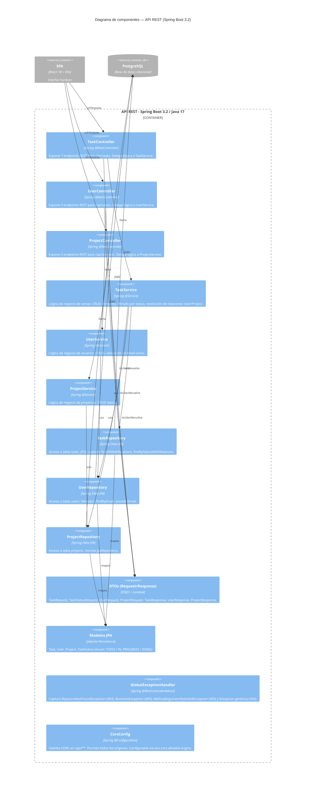

# C4 Nivel 3 — Component

Zoom dentro del contenedor **API REST** (Spring Boot). Muestra cómo se organiza internamente el backend.

## Diagrama

## Descripción de componentes

### Capa Controller

Recibe requests HTTP, valida con `@Valid`, delega al service correspondiente. No tiene lógica de negocio propia.

| Componente | Endpoints | Responsabilidad |
|------------|-----------|-----------------|
| `TaskController` | 7 — `/api/tasks` | CRUD completo de tareas + filtrado por status + actualización parcial de status |
| `UserController` | 3 — `/api/users` | Listar, obtener por ID, crear usuario |
| `ProjectController` | 3 — `/api/projects` | Listar, obtener por ID, crear proyecto |

### Capa Service

Contiene la lógica de negocio. Todas las clases son `@Transactional(readOnly = true)` por defecto; los métodos de escritura tienen `@Transactional` individual.

| Componente | Responsabilidad clave |
|------------|-----------------------|
| `TaskService` | Resuelve las relaciones User y Project antes de persistir. Mapea entidades a `TaskResponse` con builder. |
| `UserService` | Valida unicidad de email con `existsByEmail` antes de crear. Lanza `BusinessException` en duplicados. |
| `ProjectService` | CRUD simple, sin reglas de negocio adicionales en v1. |

### Capa Repository

Todas extienden `JpaRepository<T, Long>`. `TaskRepository` agrega dos queries JPQL con `LEFT JOIN FETCH` para evitar el problema N+1 al cargar las relaciones `assignedUser` y `project`.

### Modelos JPA

| Entidad | Tabla | Relaciones |
|---------|-------|------------|
| `Task` | `tasks` | `@ManyToOne` → `User` (LAZY), `@ManyToOne` → `Project` (LAZY) |
| `User` | `users` | — |
| `Project` | `projects` | — |
| `TaskStatus` | — (enum) | Valores: `TODO`, `IN_PROGRESS`, `DONE` |

### DTOs

Separan el contrato HTTP del modelo de persistencia. Los `Request` tienen anotaciones de validación Jakarta (`@NotBlank`, `@NotNull`, `@Email`). Los `Response` usan el patrón Builder de Lombok.

### GlobalExceptionHandler

Centraliza el manejo de errores. Devuelve `ErrorResponse` con campos: `status`, `error`, `message`, `path`, `timestamp`, `details`.

| Excepción capturada | HTTP status | Caso de uso |
|--------------------|-------------|-------------|
| `ResourceNotFoundException` | 404 | Entidad no encontrada por ID |
| `BusinessException` | 409 | Email de usuario duplicado |
| `MethodArgumentNotValidException` | 400 | Fallo de validación Jakarta en request |
| `Exception` (genérica) | 500 | Error inesperado |

---

Nivel anterior: [02-container.md](02-container.md)
