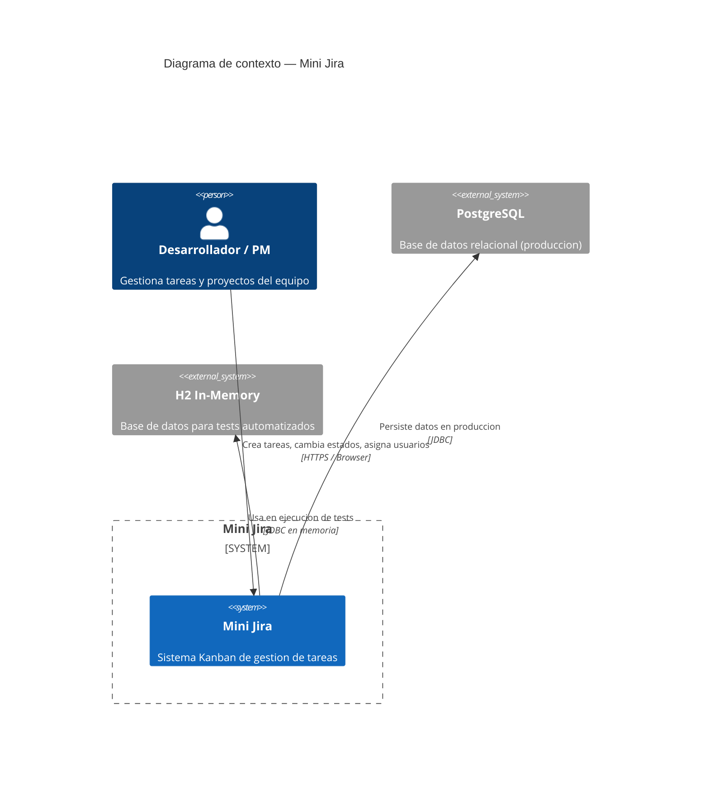
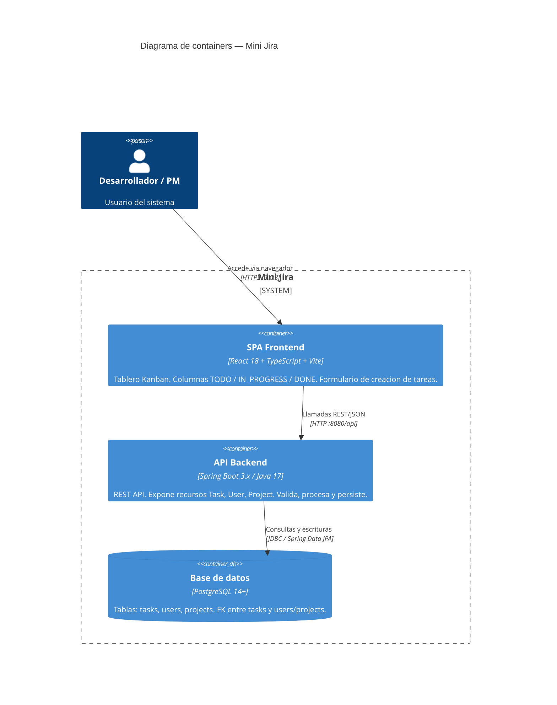
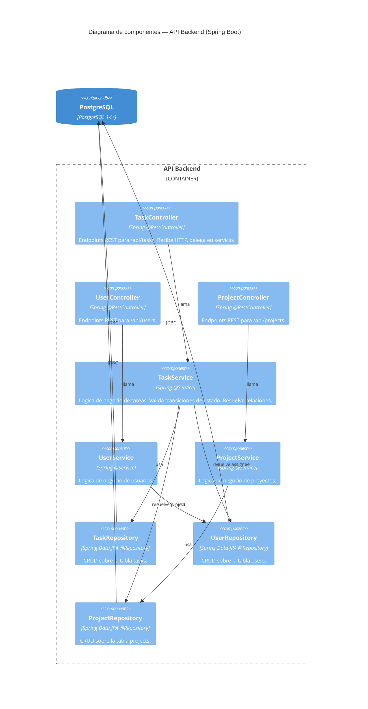

# Arquitectura — Mini Jira

Documento de arquitectura usando el modelo C4 (Simon Brown). Niveles L1 y L2 obligatorios; L3 para el container API por su complejidad interna.

---

## L1 — Diagrama de contexto

Muestra quiénes usan Mini Jira y con qué sistemas externos interactúa.



**Lectura**: un desarrollador o PM accede al sistema a través del navegador. Mini Jira persiste toda la información en PostgreSQL (producción) y usa H2 para los tests automáticos sin infraestructura externa.

---

## L2 — Diagrama de containers

Zoom dentro del sistema Mini Jira. Cada caja es un proceso desplegable independientemente.



**Decisiones clave de este nivel**:

- **SPA desacoplada del backend**: el frontend es un artefacto Vite independiente. En producción se puede servir desde un CDN o Nginx sin tocar el JAR de Spring Boot.
- **API stateless**: el backend no mantiene sesiones. Cada request lleva toda la información necesaria. Facilita el escalado horizontal.
- **PostgreSQL en producción, H2 en tests**: sin necesidad de levantar una base real para correr `mvn test`. Ver `adr/` si se agrega en el futuro.

---

## L3 — Diagrama de componentes: API Backend

Zoom dentro del container "API Backend". Muestra la arquitectura en capas.



**Responsabilidades por capa**:

| Capa        | Responsabilidad                                                    |
|-------------|--------------------------------------------------------------------|
| Controller  | Recibir y parsear HTTP. Delegar. No contiene logica de negocio.    |
| Service     | Validaciones, reglas de negocio, orquestacion entre repositorios.  |
| Repository  | Acceso a datos via Spring Data JPA. Sin logica de negocio.         |
| Model/DTO   | Entidades JPA para persistencia; DTOs para el contrato HTTP.       |

---

## Modelo de datos

```
+------------------+       +------------------+       +------------------+
|     projects     |       |      tasks       |       |      users       |
+------------------+       +------------------+       +------------------+
| id (PK)          |<--+   | id (PK)          |   +-->| id (PK)          |
| name             |   |   | title            |   |   | name             |
| description      |   |   | description      |   |   | email (unique)   |
+------------------+   |   | status           |   |   +------------------+
                        |   | story_points     |   |
                        |   | estimated_hours  |   |
                        |   | start_date       |   |
                        |   | end_date         |   |
                        +---| project_id (FK)  |   |
                            | assignee_id (FK) |---+
                            +------------------+
```

**Enum Task.status**: `TODO` | `IN_PROGRESS` | `DONE`

Relaciones:
- Una tarea pertenece a exactamente un proyecto (`project_id NOT NULL`).
- Una tarea puede tener un asignado opcional (`assignee_id NULL`).
- Un usuario puede tener muchas tareas asignadas.
- Un proyecto puede tener muchas tareas.

---

## Principios aplicados

### SOLID

| Principio | Aplicacion concreta                                                                 |
|-----------|-------------------------------------------------------------------------------------|
| SRP       | Cada clase tiene una sola razon de cambio: controller solo maneja HTTP, service solo logica. |
| OCP       | Los repositorios extienden `JpaRepository` sin modificar su contrato.               |
| LSP       | Las interfaces de servicio pueden intercambiarse por implementaciones mock en tests.|
| ISP       | Interfaces de repositorio granulares por entidad, no un repositorio "dios".        |
| DIP       | Controllers dependen de interfaces de servicio, no de implementaciones concretas.   |

### Separacion de concerns (DTOs vs Entidades)

Las entidades JPA (`@Entity`) no se exponen directamente en la API. Los DTOs definen el contrato del endpoint independientemente de la estructura de la base de datos. Esto protege contra over-posting y permite evolucionar el schema sin romper clientes.

### Tests con H2

El perfil de test usa `spring.datasource.url=jdbc:h2:mem:testdb`. El schema se regenera en cada ejecucion (`ddl-auto=create-drop`). Ningun test necesita infraestructura externa.
