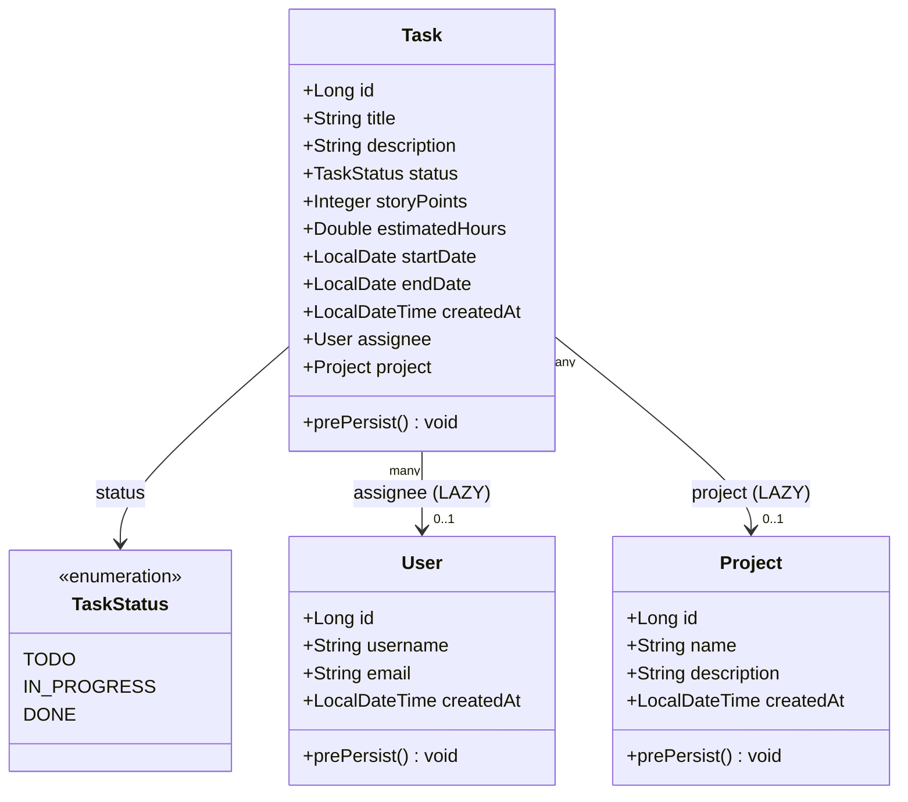
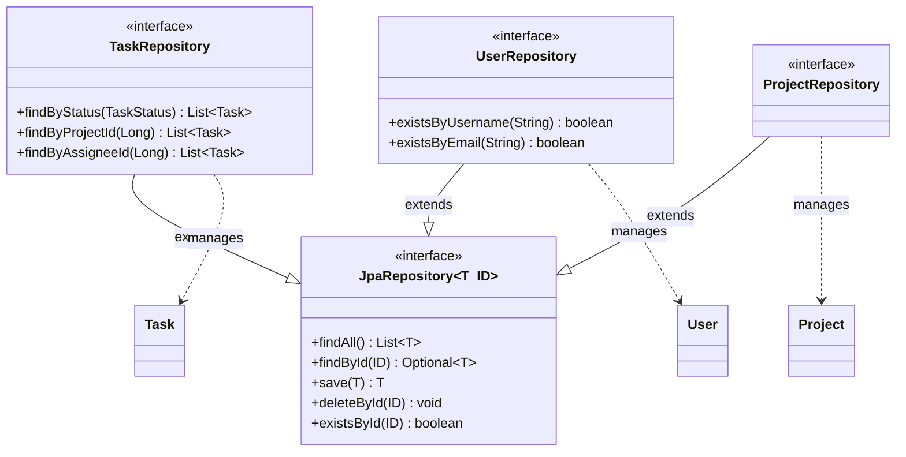
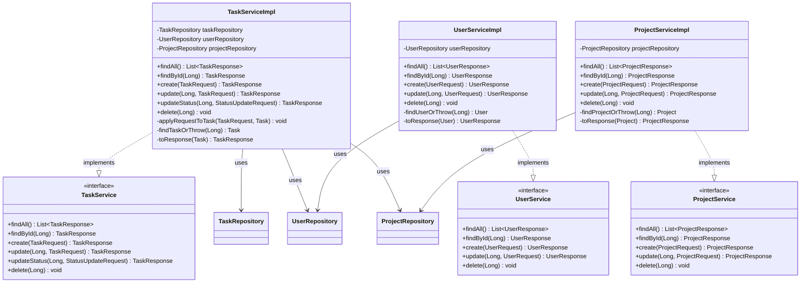
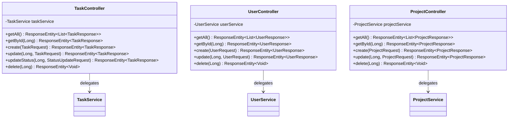
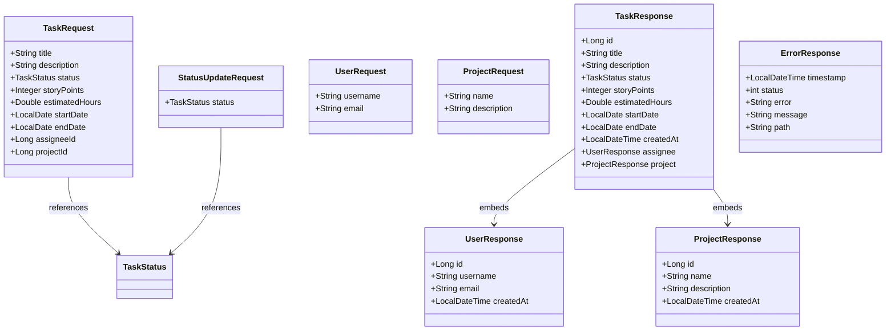
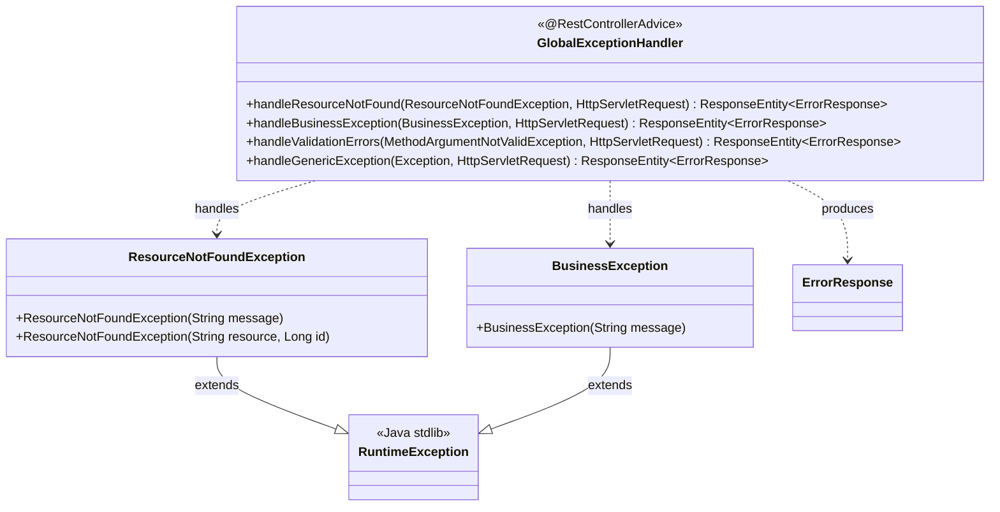
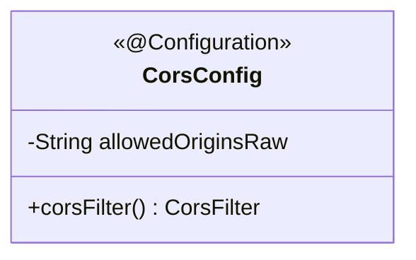
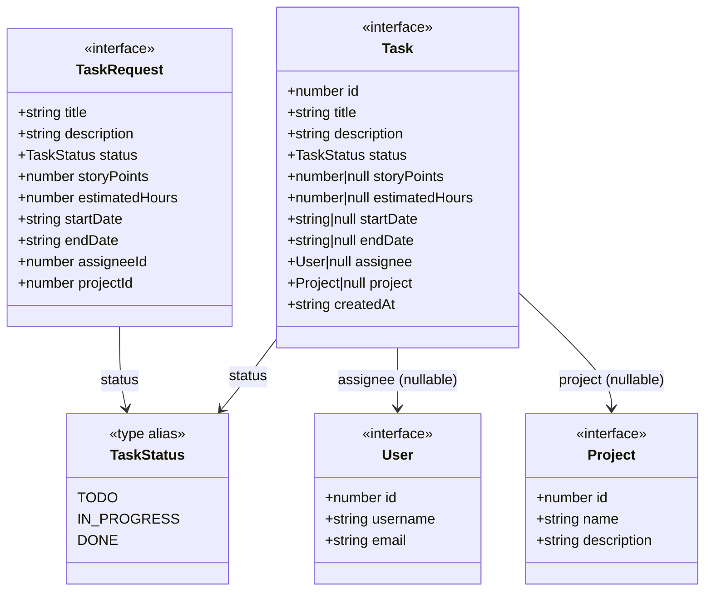
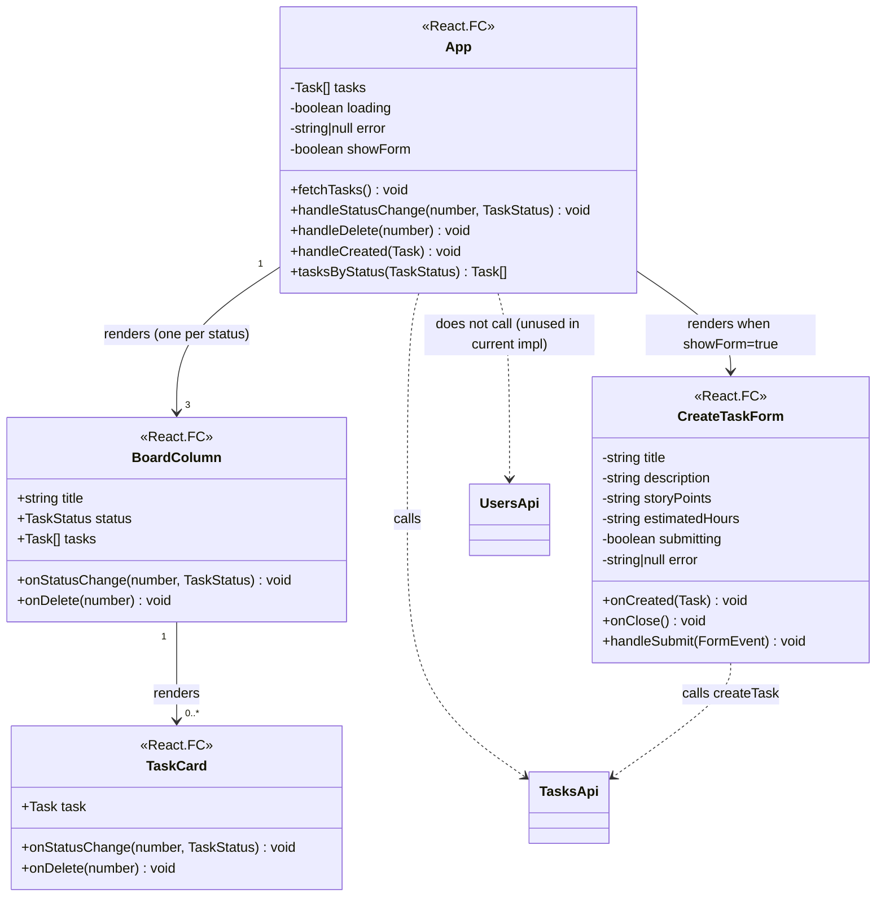

# C4 Level 4 — Diagramas de clases

Nivel de código del modelo C4. Documenta las clases, interfaces, enums y módulos reales
del sistema MiniJira. Generado a partir del código fuente de los repositorios
`MiniJira-BE` (branch `development`) y `MiniJira-FE` (branch `development`).

---

## Backend — Entidades JPA

Las entidades mapean directamente las tablas de PostgreSQL. Todas usan `GenerationType.IDENTITY`
para sus PKs y registran `createdAt` via `@PrePersist`.



---

## Backend — Repositorios

Extienden `JpaRepository<T, Long>`. Los métodos derivados son los únicos métodos
personalizados presentes en el código; el resto viene de la interfaz base de Spring Data.



---

## Backend — Servicios

Cada dominio tiene una interfaz y su implementación. `TaskServiceImpl` es el mas complejo:
depende de los tres repositorios para resolver referencias de `assignee` y `project`.



---

## Backend — Controladores REST

Todos usan `@RestController` y delegan 100% en el servicio correspondiente.
Validacion de entrada via `@Valid` + Bean Validation.



---

## Backend — DTOs

Los DTOs de request llevan anotaciones Bean Validation. Los de response son POJOs planos.
No existe ningun DTO de Auth en el codigo actual (ver nota al final del documento).



---

## Backend — Excepciones y manejo global

`GlobalExceptionHandler` captura las tres excepciones de dominio mas la generica
y devuelve siempre un `ErrorResponse` con el codigo HTTP apropiado.



**Mapeo de excepciones a HTTP:**

| Excepcion | HTTP | `error` en body |
|---|---|---|
| `ResourceNotFoundException` | 404 | `Not Found` |
| `BusinessException` | 409 | `Conflict` |
| `MethodArgumentNotValidException` | 400 | `Bad Request` |
| `Exception` (cualquier otra) | 500 | `Internal Server Error` |

---

## Backend — Configuracion CORS

No hay `SecurityConfig` ni `JwtUtil` en el codigo actual. La unica configuracion de
infraestructura presente es `CorsConfig`.



`allowedOriginsRaw` se inyecta desde la propiedad `cors.allowed-origins`
(default: `http://localhost:5173,http://localhost:3000`).
Metodos permitidos: GET, POST, PUT, PATCH, DELETE, OPTIONS. Credentials: true.

---

## Frontend — Tipos (`types.ts`)

Interfaces y tipos TypeScript que espeja el schema del backend.



Nota: `User` y `Project` en el frontend no incluyen `createdAt`. El backend los
devuelve en `UserResponse` y `ProjectResponse`, pero `types.ts` no lo expone.

---

## Frontend — Modulo API (`api.ts`)

Cliente HTTP construido sobre `axios`. Base URL hardcodeada a `http://localhost:8080/api`.

```mermaid
classDiagram
    class ApiClient {
        <<axios instance>>
        +baseURL: http://localhost:8080/api
        +Content-Type: application/json
    }

    class TasksApi {
        <<exported functions>>
        +getTasks() Promise~Task[]~
        +createTask(TaskRequest) Promise~Task~
        +updateTaskStatus(number, TaskStatus) Promise~Task~
        +deleteTask(number) Promise~void~
    }

    class UsersApi {
        <<exported functions>>
        +getUsers() Promise~User[]~
        +createUser(username, email) Promise~User~
    }

    TasksApi --> ApiClient : GET /tasks
    TasksApi --> ApiClient : POST /tasks
    TasksApi --> ApiClient : PATCH /tasks/:id/status
    TasksApi --> ApiClient : DELETE /tasks/:id
    UsersApi --> ApiClient : GET /users
    UsersApi --> ApiClient : POST /users
```

El FE no implementa `getById`, `update` completo ni ningun endpoint de Projects
(aunque el backend los expone). Solo consume el subconjunto necesario para el tablero Kanban.

---

## Frontend — Componentes React



`LoginForm` y `RegisterForm` mencionados en la mision no existen en el codigo fuente del FE.

---

## Discrepancias entre la mision y el codigo real

Las siguientes clases/modulos estaban listados en la mision pero **no existen** en el codigo:

| Clase/modulo esperado | Ubicacion buscada | Veredicto |
|---|---|---|
| `AuthController` | `controller/` | No existe |
| `AuthServiceImpl` | `service/` | No existe |
| `JwtUtil` | cualquier paquete | No existe |
| `SecurityConfig` | `config/` | No existe. Solo existe `CorsConfig` |
| `AuthResponse` DTO | `dto/` | No existe |
| `LoginRequest` DTO | `dto/` | No existe |
| `RegisterRequest` DTO | `dto/` | No existe |
| `LoginForm` (FE) | `src/components/` | No existe |
| `RegisterForm` (FE) | `src/components/` | No existe |

El sistema **no implementa autenticacion** en el codigo actual. Los endpoints `/api/auth/*`
listados en la mision no tienen handler. Este documento refleja lo que esta en el codigo.
