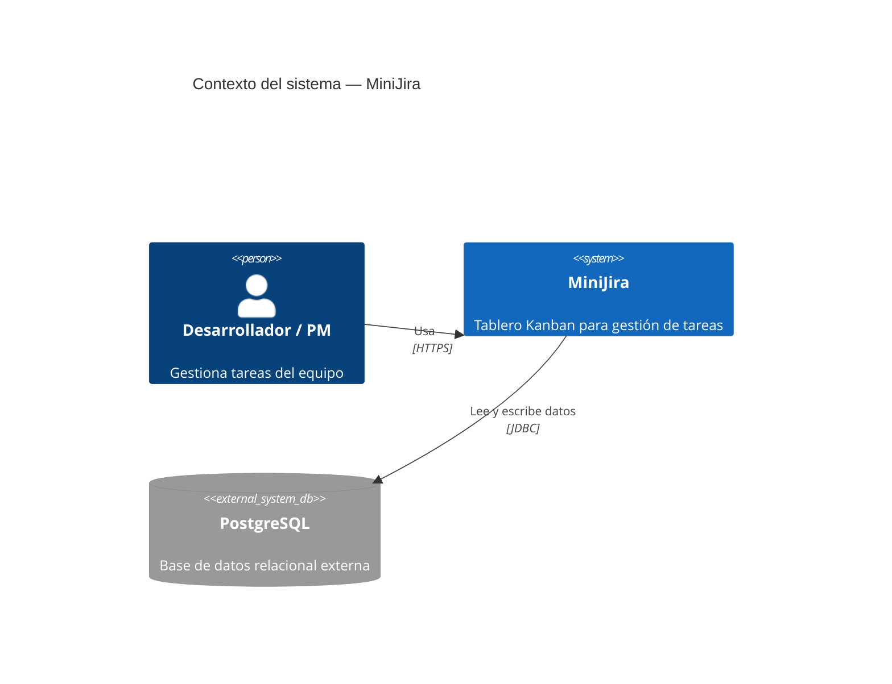
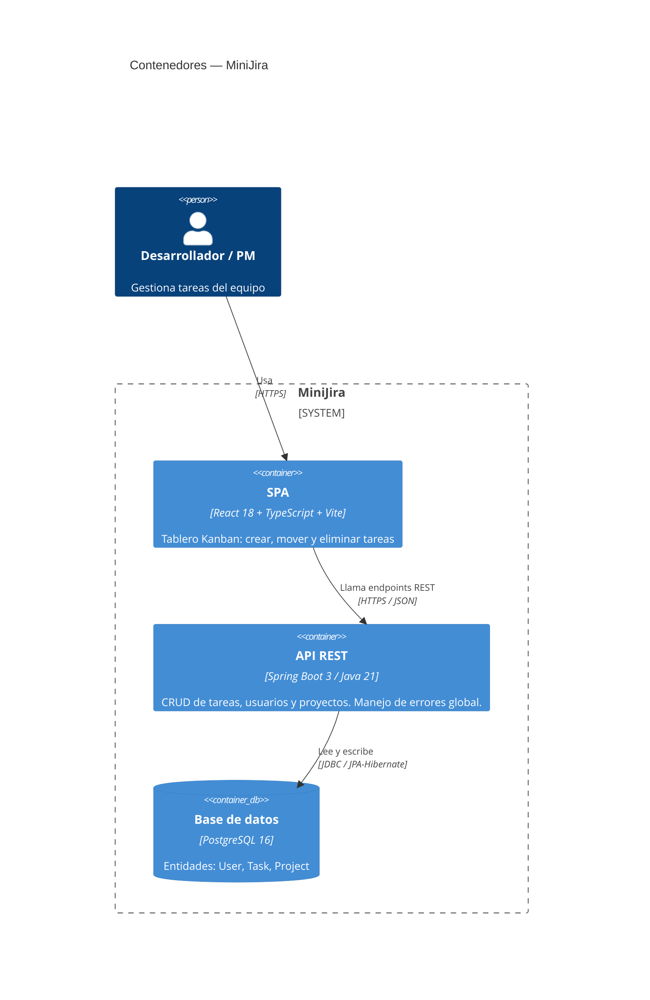
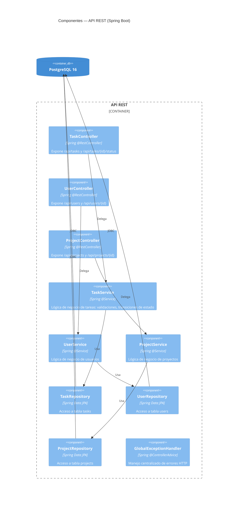

# Test 01 — Sistema MiniJira: Implementación Fullstack

**Fecha:** 2026-05-10  
**Branch:** `feat/test-01-fullstack`  
**Estado:** Completado

---

## 1. Descripción del sistema

MiniJira es un sistema de gestión de tareas estilo Kanban construido como fullstack monolito desacoplado:

- **Backend**: API REST en Spring Boot con persistencia en PostgreSQL.
- **Frontend**: SPA en React + TypeScript + Vite con tablero Kanban de 3 columnas.

El objetivo del Test 01 fue implementar el CRUD completo de tareas, usuarios y proyectos, más la interfaz visual que permite mover tarjetas entre columnas.

---

## 2. Arquitectura

### 2.1 Diagrama de Contexto (L1)



### 2.2 Diagrama de Contenedores (L2)



### 2.3 Diagrama de Componentes — API REST (L3)



**Patrón**: Controller → Service → Repository (arquitectura en capas estándar de Spring Boot). El `GlobalExceptionHandler` intercepta excepciones no controladas y devuelve respuestas de error estructuradas.

---

## 3. Entidades del dominio

### Task

| Campo            | Tipo     | Descripción                              |
|------------------|----------|------------------------------------------|
| `id`             | Long     | Identificador auto-generado              |
| `title`          | String   | Título de la tarea                       |
| `description`    | String   | Descripción detallada                    |
| `status`         | Enum     | `TODO`, `IN_PROGRESS`, `DONE`            |
| `storyPoints`    | Integer  | Puntos de estimación (metodología ágil)  |
| `estimatedHours` | Double   | Horas estimadas                          |
| `startDate`      | Date     | Fecha de inicio                          |
| `endDate`        | Date     | Fecha de fin                             |
| `userId`         | Long     | FK hacia la entidad User                 |

### User

| Campo  | Tipo   | Descripción             |
|--------|--------|-------------------------|
| `id`   | Long   | Identificador           |
| `name` | String | Nombre del usuario      |
| `email`| String | Email (único)           |

### Project

| Campo         | Tipo   | Descripción           |
|---------------|--------|-----------------------|
| `id`          | Long   | Identificador         |
| `name`        | String | Nombre del proyecto   |
| `description` | String | Descripción           |

---

## 4. Endpoints

### 4.1 Tareas (`/api/tasks`)

| Método   | Ruta                       | Descripción                                 |
|----------|----------------------------|---------------------------------------------|
| `GET`    | `/api/tasks`               | Lista todas las tareas                      |
| `POST`   | `/api/tasks`               | Crea una tarea nueva                        |
| `GET`    | `/api/tasks/{id}`          | Obtiene una tarea por ID                    |
| `PUT`    | `/api/tasks/{id}`          | Actualiza todos los campos de una tarea     |
| `DELETE` | `/api/tasks/{id}`          | Elimina una tarea                           |
| `PATCH`  | `/api/tasks/{id}/status`   | Actualiza solo el estado de la tarea        |

#### POST `/api/tasks` — Body de ejemplo

```json
{
  "title": "Implementar login con JWT",
  "description": "Agregar autenticación stateless al backend",
  "status": "TODO",
  "storyPoints": 5,
  "estimatedHours": 8.0,
  "startDate": "2026-05-10",
  "endDate": "2026-05-15",
  "userId": 1
}
```

#### Respuesta 201 Created

```json
{
  "id": 42,
  "title": "Implementar login con JWT",
  "description": "Agregar autenticación stateless al backend",
  "status": "TODO",
  "storyPoints": 5,
  "estimatedHours": 8.0,
  "startDate": "2026-05-10",
  "endDate": "2026-05-15",
  "userId": 1
}
```

#### PATCH `/api/tasks/{id}/status` — Body de ejemplo

```json
{
  "status": "IN_PROGRESS"
}
```

#### Respuesta 200 OK

```json
{
  "id": 42,
  "status": "IN_PROGRESS"
}
```

---

### 4.2 Usuarios (`/api/users`)

| Método   | Ruta               | Descripción                          |
|----------|--------------------|--------------------------------------|
| `GET`    | `/api/users`       | Lista todos los usuarios             |
| `POST`   | `/api/users`       | Crea un usuario nuevo                |
| `GET`    | `/api/users/{id}`  | Obtiene un usuario por ID            |
| `PUT`    | `/api/users/{id}`  | Actualiza los datos de un usuario    |
| `DELETE` | `/api/users/{id}`  | Elimina un usuario                   |

#### POST `/api/users` — Body de ejemplo

```json
{
  "name": "Ana Gómez",
  "email": "ana.gomez@devforce.ai"
}
```

#### Respuesta 201 Created

```json
{
  "id": 3,
  "name": "Ana Gómez",
  "email": "ana.gomez@devforce.ai"
}
```

---

### 4.3 Proyectos (`/api/projects`)

| Método   | Ruta                  | Descripción                           |
|----------|-----------------------|---------------------------------------|
| `GET`    | `/api/projects`       | Lista todos los proyectos             |
| `POST`   | `/api/projects`       | Crea un proyecto nuevo                |
| `GET`    | `/api/projects/{id}`  | Obtiene un proyecto por ID            |
| `PUT`    | `/api/projects/{id}`  | Actualiza los datos de un proyecto    |
| `DELETE` | `/api/projects/{id}`  | Elimina un proyecto                   |

#### POST `/api/projects` — Body de ejemplo

```json
{
  "name": "MiniJira v1",
  "description": "Sistema de gestión de tareas tipo Kanban"
}
```

#### Respuesta 201 Created

```json
{
  "id": 1,
  "name": "MiniJira v1",
  "description": "Sistema de gestión de tareas tipo Kanban"
}
```

---

## 5. Configuración

### 5.1 Variables de entorno — Backend

El backend lee su configuración exclusivamente desde variables de entorno. No hay valores hardcodeados en el código.

| Variable                  | Descripción                                          | Ejemplo                                          |
|---------------------------|------------------------------------------------------|--------------------------------------------------|
| `DB_URL`                  | URL de conexión JDBC a PostgreSQL                    | `jdbc:postgresql://localhost:5432/minijira`      |
| `DB_USERNAME`             | Usuario de la base de datos                          | `minijira_user`                                  |
| `DB_PASSWORD`             | Contraseña de la base de datos                       | _(usar secret manager o archivo `.env` local)_   |
| `CORS_ALLOWED_ORIGINS`    | Origen(s) permitidos por CORS (separados por coma)   | `http://localhost:5173`                          |

Ejemplo de archivo `.env` local (nunca commitear):

```
DB_URL=jdbc:postgresql://localhost:5432/minijira
DB_USERNAME=minijira_user
DB_PASSWORD=tu_password_local
CORS_ALLOWED_ORIGINS=http://localhost:5173
```

---

## 6. Instrucciones de ejecución

### 6.1 Requisitos previos

| Herramienta | Versión mínima |
|-------------|----------------|
| Java        | 21             |
| Maven       | 3.9            |
| Node.js     | 20             |
| npm         | 10             |
| PostgreSQL  | 15             |

### 6.2 Backend (Spring Boot)

```bash
# 1. Clonar el repositorio del backend
git clone https://github.com/Alitocoin/MiniJira-BE.git
cd MiniJira-BE

# 2. Exportar variables de entorno (o copiar .env y usar dotenv)
export DB_URL=jdbc:postgresql://localhost:5432/minijira
export DB_USERNAME=minijira_user
export DB_PASSWORD=tu_password_local
export CORS_ALLOWED_ORIGINS=http://localhost:5173

# 3. Compilar y ejecutar
./mvnw spring-boot:run
```

El servidor arranca en `http://localhost:8080` por defecto. JPA/Hibernate crea las tablas automáticamente en el primer arranque si la base de datos existe y el usuario tiene permisos DDL.

### 6.3 Frontend (React + Vite)

```bash
# 1. Clonar el repositorio del frontend
git clone https://github.com/Alitocoin/MiniJira-FE.git
cd MiniJira-FE

# 2. Instalar dependencias
npm install

# 3. Desarrollo local
npm run dev
# → http://localhost:5173

# 4. Build de producción (debe pasar sin errores)
npm run build
```

El frontend espera el backend en `http://localhost:8080`. Si cambiás el puerto, actualizá la variable de entorno o el archivo de configuración de Vite (`VITE_API_URL` o equivalente).

---

## 7. Métricas del Test 01

| Categoría              | Detalle                                                        |
|------------------------|----------------------------------------------------------------|
| Endpoints implementados| 15 (5 por recurso × 3 recursos) + 1 PATCH de status = 16 rutas|
| Entidades              | 3 (User, Task, Project)                                        |
| Capas de arquitectura  | 3 por recurso: Controller, Service, Repository                 |
| Manejo de errores      | Centralizado con `@ControllerAdvice`                           |
| Frontend               | Tablero Kanban con 3 columnas, crear / mover / eliminar tareas |
| Build frontend         | `npm run build` pasa sin errores                               |
| Persistencia           | JPA/Hibernate con PostgreSQL, esquema auto-generado            |

---

## 8. Decisiones de diseño

**Controller → Service → Repository**: patrón estándar de Spring Boot. Mantiene la lógica de negocio desacoplada de la capa HTTP y de la capa de persistencia. Facilita tests unitarios por capa.

**PATCH para cambio de estado**: se optó por un endpoint dedicado `PATCH /api/tasks/{id}/status` en lugar de usar `PUT` completo. Esto reduce el payload y hace explícito el contrato del tablero Kanban.

**CORS por variable de entorno**: `CORS_ALLOWED_ORIGINS` permite que el mismo binario se use en local (`localhost:5173`), staging y producción sin recompilar.

**JPA auto-schema**: Hibernate genera el DDL en el primer arranque. Para producción se recomienda migrar a Flyway o Liquibase para control de versiones del esquema.

---

## 9. Pendientes / puntos a mejorar

- Autenticación: actualmente la API no tiene auth. A implementar en tests posteriores.
- Paginación: `GET /api/tasks` devuelve todos los registros. Agregar paginación cuando el volumen crezca.
- Validaciones de entrada: verificar que Spring Validation (`@Valid`, `@NotBlank`, etc.) esté activo en los DTOs.
- Migraciones de base de datos: reemplazar auto-DDL de Hibernate por Flyway.
- Tests: cobertura de unit + integration tests pendiente para el Test 04.
